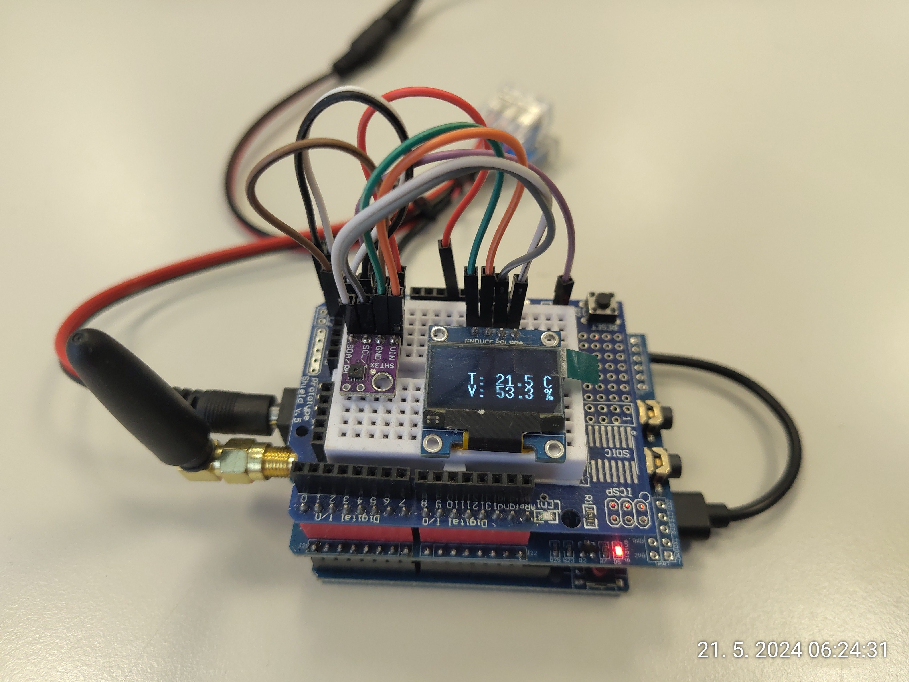

# uno-thermometer

Uno thermometer is a very simple device based on the Arduino Uno R3/R4 to measure and display indoor temperature and humidity. The values are shown on an OLED display.

features:
* Arduino Uno R3 or R4
* SHT31 or DHT22 for temperature + humidity sensing
* OLED display to show the values (SSD1306, 128X64 px)
* optional: SIM900 shield for cellular connectivity (for sending the valuies to Adafruit IO)

Uncomment one of the following lines to choose whether you are using DHT22 or SHT31 sensor.

```
//#define USE_DHT22
//#define USE_SHT31
```


Comment or uncomment the following line to choose whether you want to be using the SIM900 module and send the data to Adafruit IO:

```
#define USE_GSM
```

The arduino_secrets.h is supposed to contain the following:

```
#define IO_USERNAME  "your Adafruit IO username"
#define IO_KEY       "your Adafruit IO KEY"
#define IO_FEED_TEMP "feed key in Adafruit IO for temperature"
#define IO_FEED_HUM  "feed key in Adafruit IO for humidity"
```



