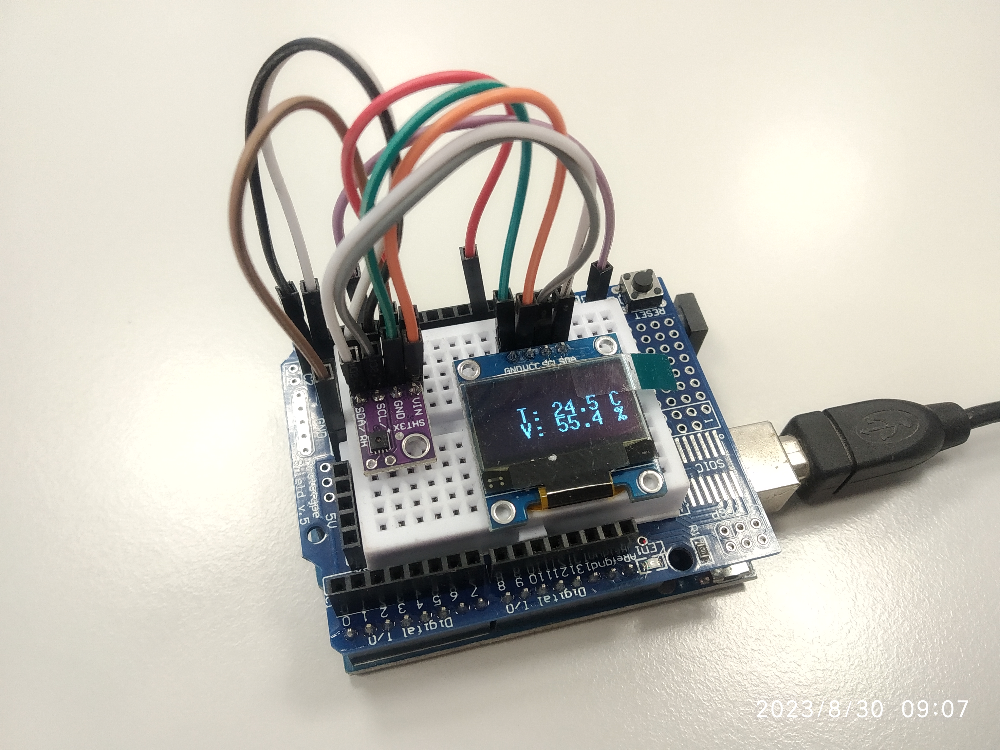

# uno-r3-thermometer

Uno R3 thermometer is a very simple device the Arduino Uno R3 to measure and display indoor temperature and humidity. The values are shown on an OLED display.

features:
* Arduino Uno
* SHT31 or DHT22 for temperature + humidity sensing
* OLED display to show the values (SSD1306, 128X64 px)

Uncomment one of the following lines to choose whether you are using DHT22 or SHT31 sensor.

```
//#define USE_DHT22
//#define USE_SHT31
```


